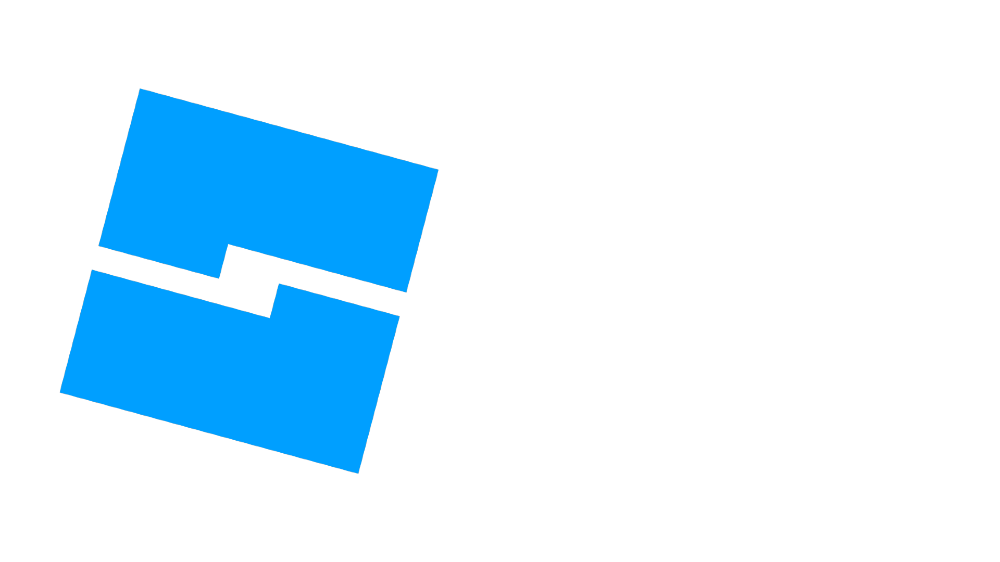

# Roblox-Studio-Editor-Theme
A compilation of themes for Roblox Studio's editor.

Most of the themes are taken from Visual Studio Code, others include Vim and other editors.

## Applying theme
To apply a theme to your editor, you have to do it manually since this is not a plugin.
Copy the color value and paste it to the corresponding token label you have copied it from.

## License
This project falls under the MIT License.
 
If you're making a plugin out of this, please put some credits to the original repo.